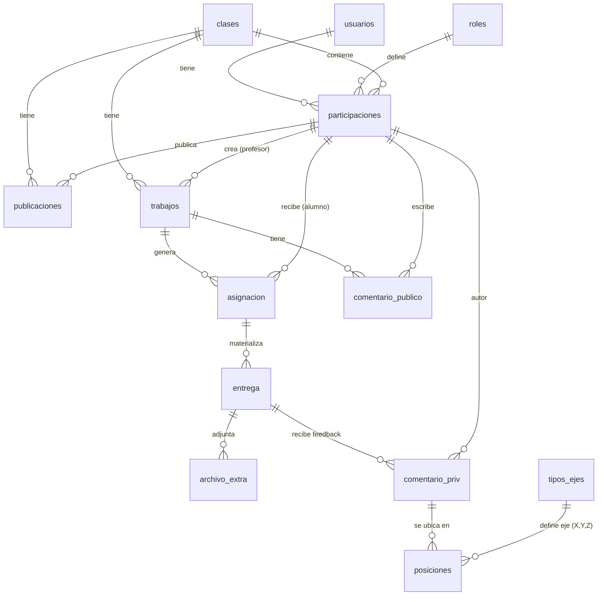

# GonoS — Contexto Maestro del Proyecto y Base de Conocimiento

> Este documento contiene el contexto integral, estado técnico real, decisiones de arquitectura, esquema de base de datos y plan de diseño UX/UI del proyecto **GonoS**. Sirve como memoria permanente para cualquier agente de Antigravity o desarrollador que trabaje en el repositorio.

---

## 1. Identidad del Proyecto y Propósito

**GonoS** es una plataforma web educativa tipo "Google Classroom", especialmente diseñada para carreras y cátedras de **Arquitectura, Diseño y Matemática**.

### Problema que resuelve:
Tradicionalmente, para revisar trabajos de geometría o arquitectura, los docentes debían descargar archivos pesados (`.obj`, `.stl`, `.ifc`, `.svg`) y abrir software CAD/3D externo en sus computadoras.
En GonoS:
- Los alumnos entregan modelos 3D y vectoriales directamente.
- El docente visualiza, rota, inspecciona y realiza zoom sobre el modelo **dentro del navegador**, sin descargar nada ni abrir ventanas emergentes.
- El docente puede hacer clic sobre un punto específico de la superficie del modelo 3D y dejar un **comentario anclado a coordenadas espaciales $(X, Y, Z)$**.
- Incluye tablón de publicaciones públicas por clase, gestión de entregas, calificaciones y control de estados.

---

## 2. Stack Tecnológico Real (Vigente y Obligatorio)

> [!IMPORTANT]
> **Aclaración de Stack (No confundir con versiones preliminares):**
> El proyecto **NO utiliza Java ni React**. El stack implementado y definitivo es:

| Capa | Tecnología | Características |
|---|---|---|
| **Backend** | **Node.js 18+ con Express.js** | Arquitectura modular en `/routes` y `/utils`, sin ORM. |
| **Base de Datos** | **MariaDB 10.6+** | Administrada mediante DBeaver, consultas parametrizadas con `mysql2/promise`. |
| **Frontend** | **Vue 3 (Composition API) + Vite** | SPA rápida, Vue Router 4, estado reactivo con `reactive()` (sin Pinia). |
| **Estilos** | **CSS Puro con variables CSS** | Sin frameworks como Tailwind o Bootstrap. Paleta centralizada en `theme.css`. |
| **Motor 3D** | **Three.js + @thatopen/components** | Soporte de `.obj`, `.stl`, `.gltf`, `.glb`, `.ifc` y fallback para `.fbx`. |
| **Motor Vectorial** | **Nativo SVG** (`SvgViewer2D.vue`) | Zoom y pan interactivo para archivos `.svg`. |
| **Autenticación** | **JWT manual + bcryptjs** | Tokens firmados, sin Passport. |
| **Uploads** | **Multer (almacenamiento en disco)** | Sanitización de nombres con UUID, límite de 50MB. |

---

## 3. Modelo de Base de Datos MariaDB (Fuente de Verdad)

La base de datos `gonos` cuenta con las siguientes tablas y relaciones activas (verificadas con DBeaver):

### Detalle de Tablas Clave:
1. `usuarios`: Cuentas de acceso (`usuario_id`, `mail`, `nombre`, `apellido`, `password_hash`, `activo`).
2. `roles`: Catálogo (`Creador`, `Profesor`, `Alumno`).
3. `participaciones`: Define el rol del usuario **por clase** (un usuario puede ser profesor en una materia y alumno en otra).
4. `clases`: Cátedras creadas (`clase_id`, `nombre`, `descripcion`, `codigo` de 6 caracteres único para unirse).
5. `publicaciones`: Tablón social / anuncios de la cátedra.
6. `trabajos`: Trabajos prácticos con consigna, fecha límite, formatos JSON y nota mínima de aprobación.
7. `asignacion`: Relación de un alumno con un trabajo. Registra la `nota` y el `estado` (`Pendiente`, `En revisión`, `Revisado`, `Aprobado`).
8. `entrega`: Archivo físico subido por el alumno (`archivo` con UUID, `nombre_original`, `fecha_entrega`, `devolucion`).
9. `archivo_extra`: Archivos adicionales de soporte (imágenes, planos de apoyo, PDFs).
10. `comentario_publico`: Preguntas y avisos visibles por todos sobre un TP específico.
11. `comentario_priv`: Feedback privado del docente sobre una entrega concreta.
12. `posiciones`: Coordenadas 3D de un comentario privado (`com_priv_id`, `teje_id`, `valor`).
13. `tipos_ejes`: Catálogo de ejes espaciales (`teje_id`, `tipo`: 'X', 'Y', 'Z').

---

## 4. Estado Actual de la Aplicación y Novedades Implementadas

A diferencia de los sprints originales preliminares, la aplicación ya cuenta con:
1. **Fondo Interactivo Punteado (`DotsBackground.vue`):**
   Canvas 2D fijado de fondo (`position: fixed; inset: 0; z-index: 0; pointer-events: none;`) que genera una cuadrícula de puntos técnicos que crecen, se iluminan y reaccionan dinámicamente a la proximidad del mouse.
2. **Tablón de Comentarios y Publicaciones en Clases (`ClassView.vue`):**
   Pestañas activas: *Tablón* (publicaciones y anuncios), *Trabajos* (listado de tareas con consignas) y *Participantes* (gestión de alumnos y docentes).
3. **Visor 3D y 2D en `ReviewView.vue`:**
   Tres columnas integradas con visualización Three.js, árbol de elementos (`ElementTree.vue`), panel de anotaciones y calificación con nota mínima.
4. **Tarjetas con Animaciones (`ClassCard.vue`, `AssignmentCard.vue`):**
   Efecto de elevación (`translateY(-3px)`), sombras de profundidad y acento en hover.

---

## 5. Sistema de Diseño Visual y Reglas Estéticas

- **Filosofía:** Minimalista, técnico, arquitectónico y monocromático.
- **Modo Claro (`:root`):**
  - Fondo: `#FAFAF8` (blanco crema técnico).
  - Fondo elevado (tarjetas/modales): `#FFFFFF`.
  - Color de Acento Único: **Azul Teal `#19B0B5`** (`--color-accent`).
- **Modo Oscuro (`[data-theme="dark"]`):**
  - Fondo: `#121212` (antracita profundo).
  - Fondo elevado: `#1B1B1B`.
  - Color de Acento Único: **Naranja `#E06710`** (`--color-accent`).
- **Restricción absoluta:** Nunca hardcodear colores hex fuera de `theme.css`. Todo componente debe usar `var(--color-accent)`, `var(--color-bg)`, etc.

---

## 6. Plan Maestro de UX / UI / Feedback de Carga y QoL Acordado

### Fase 1: Feedback Visual, Skeletons y Eliminación de Alertas Nativas
- Reemplazar textos planos ("Cargando clases...") por **Skeletons arquitectónicos animados** con efecto `shimmer` que simulan las siluetas de tarjetas y listas.
- Eliminar `alert()` y `confirm()` nativos del navegador; implementar sistema de **Toasts no intrusivos** con temporizador y modales de confirmación con diseño geométrico.
- Loader 3D de porcentaje real con animación geométrica de wireframe durante la descarga y parseo de modelos pesados.

### Fase 2: Profundidad Espacial y Sinergia con el Fondo Punteado
- **Glassmorphism calibrado:** Aplicar `backdrop-filter: blur(10px)` con transparencias suaves en tarjetas, modales y barras flotantes para que la cuadrícula de puntos interactivos del fondo se intuya suavemente con profundidad.
- **Spotlight Hover en Tarjetas:** Sutil halo de luz que sigue la posición del cursor en los bordes de las tarjetas de clase y trabajos.
- **Modo Cuadrícula / Blueprint:** Alternador opcional en header entre puntos interactivos y papel milimetrado/isométrico.

### Fase 3: Visor 3D Avanzado & Anotaciones
- **Pins 3D con animación de pulso (radar pulse)** en el color de acento.
- **Popover de previsualización al pasar el mouse sobre un pin 3D** (muestra autor y fragmento del comentario antes de hacer clic).
- **Interpolación suave de cámara (Lerp/Tween):** Al seleccionar un comentario de la lista lateral, la cámara orbita y se acerca fluidamente al punto $(X,Y,Z)$ anotado.
- **Toolbar flotante semitransparente sobre el canvas:** Botones para alternar proyección Ortogonal/Perspectiva, modo Wireframe (malla polifacética), cortes de sección y pantalla completa.

### Fase 4: Quality of Life (QoL) en Entregas y Tablón
- **Dropzone táctil:** Zona de arrastre que reacciona visualmente con badges de tipo de archivo (`.OBJ`, `.STL`, `.SVG`) y validación instantánea de peso (<50MB).
- **Píldoras de estado luminosas:** Semáforo de estados de entrega (`Pendiente`, `En revisión`, `Aprobado`).
- **Atajos de teclado en escritorio:** `Espacio` para resetear vista 3D, `W` para wireframe, `Esc` para modales.

---

## 7. Directivas de Trabajo para Agentes en este Repositorio

1. **No romper el stack:** Mantener JavaScript puro ES2022, Vue 3 Composition API y Express.
2. **No alterar `.env`:** Solo documentar en `.env.example`.
3. **No ejecutar DROP/ALTER directo sin autorización:** Proponer scripts en `backend/database/` para que el usuario los ejecute en DBeaver o autorice su ejecución.
4. **Seguridad obligatoria:** Validar ownership anti-IDOR en endpoints con `:id`, sanitizar entradas de texto y usar `pool.execute` con parámetros.
5. **Autoverificación:** Verificar siempre con `npm run build` en frontend o tests unitarios antes de dar una tarea por cerrada.
